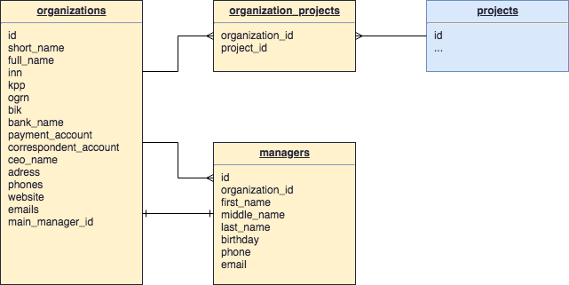

# Redmine Business Contacts

This is a plugin for Redmine which adds a business contacts functionality.

## Install

## Requirements

* **Ruby 2.3+**
* **Redmine 3.4+**
* Standard install plugin:

```
cd {REDMINE_ROOT}
git clone https://github.com/ilyabelyakov/business_contacts.git plugins/business_contacts
bundle install RAILS_ENV=production
bundle exec rake redmine:plugins:migrate RAILS_ENV=production
```

## Database schema



## Tests

```
cd {REDMINE_ROOT}
bundle exec rake db:drop db:create db:migrate redmine:plugins:migrate redmine:load_default_data RAILS_ENV=test
```

## Run tests

```
cd {REDMINE_ROOT}
rspec plugins/business_contacts/spec/
```
